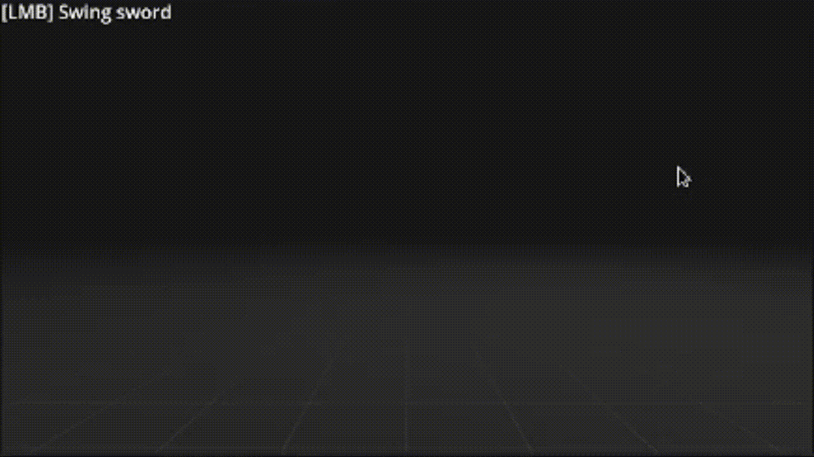
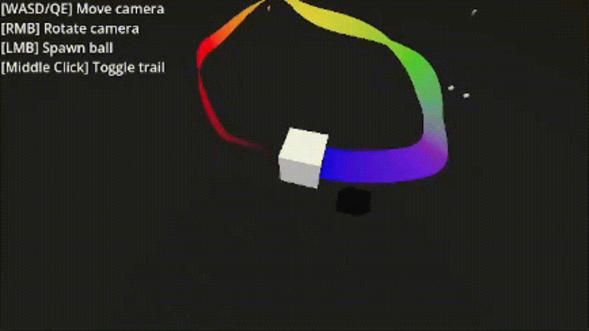
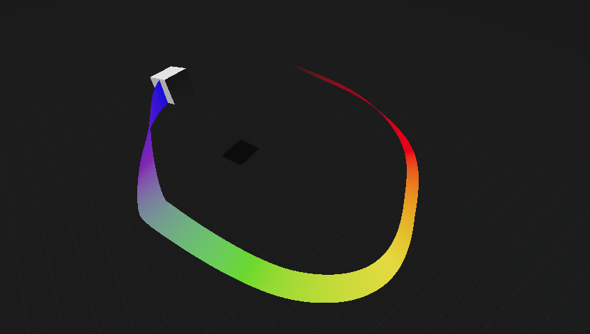
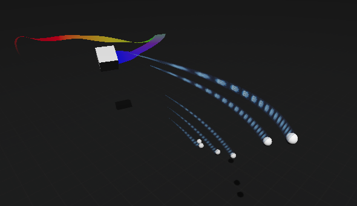

<h1 align="center">
  <br>
  
  <br>
  Trail Renderer
  <br>
</h1>

<h4 align="center">A trail/ribbon renderer for Godot similar to Unity's <a href="https://docs.unity3d.com/Manual/class-TrailRenderer.html">TrailRenderer component</a></h4>






## Roadmap
1. [About](#about)
2. [Godot 4.5+ Update](#godot-45-update)
3. [Features](#features)
4. [Installation and Setup](#installation-and-setup)
5. [Usage](#usage)
6. [Trail Settings](#trail-settings)

## About
This is an implementation of trail/ribbon renderer similar to that in Unity. It can be used to give an emphasized feeling of motion to a moving object, or to highlight the path or position of moving objects. It also comes with a LineRenderer which is actually what's used by the TrailRenderer to draw the trail. Note that this plugin only supports 3D.

### Godot 4.5+ Update
> [!IMPORTANT]
> The new updates are only present in C# version of the plugin.
> GDScript version will probably work fine in new Godot versions but doesn't have the new features until someone else adds them because I don't know GDScript well enough to do so.

<h4> What has changed: </h4>

* **New Texture Modes:** Added new texture modes add fixed the existing ones
* **Better Alignment**: Fixed some of the jank with alignment modes
* **Beveling:** Added beveling with Chaikin's algorithm to smooth out the edges. This helps with trails that have high `MinVertexDistance`.

## Features
* Variable width with curve
* Variable color with gradient
* Different alignment modes
* Texture modes (tiling, stretching, static, etc.)
* Beveling for smoother edges

## Installation and Setup
### Installation
Clone this repo:
```
git clone https://github.com/Hyrdaboo/TrailRenderer/
```
If you don't have git you can also download zip by clicking _**Code>Download ZIP**_
### Setup
* After completing the installation, navigate to the downloaded files, and you will find the _addons_ folder.
* Drag and drop this folder into your project.
* If your project already has an _addons_ folder then drag and drop the contents of the _addons_ folder into your existing one.

You will also need this input configuration if you want to check out the demos:


## Usage
Simply create a new _Node3D_ and add a TrailRenderer script to it. Use `TrailRenderer.cs` for C# and `trail_renderer.gd` for GDScript. All scripts are located under `addons/TrailRenderer/Runtime/` and GDScript version is in `GD/` subfolder. 

You can move this object in your game either from code or parenting it to another object(whatever you wish) and it will draw a trail behind it. You can also change the parameters you set in the inspector from code.

> [!NOTE]
> `TrailRenderer` inherits from `LineRenderer` so below parameters show them together. 
>
> `TrailRenderer` specific parameters are below `TrailRenderer` and `LineRenderer` specific parameters are below `LineRenderer`.


## Trail Settings
### TrailRenderer
* **Lifetime:** Define lifetime of points of the trail in seconds
* **Min Vertex Distance:** The minimum distance between points in the trail, in world units.
* **Emitting:** When this is enabled new points are being added to the trail. Use this to pause/unpause the trail.
### LineRenderer
* **Curve:** Control the width of the trail along its length using a curve
* **Alignment:** Set the direction that the trail faces.
  * **View:** The trail faces the camera
  * **TransformZ:** The trail faces the Z axis of its GlobalBasis
  * **Static:** Every quad in the trail face the Z axis of the object's GlobalBasis when the point was emitted
* **Bevel Iterations:** Number of subdivisions for the trail mesh edges. Higher values result in smoother edges but may impact performance.
* **Bevel Amount:** The amount of bevel applied to the trail mesh edges.
#### Appearance
  * **Material:** Material override used by the trail
  * **Cast Shadows:** Set the shadow casting mode for the trail mesh
  * **Color Gradient:** Define a gradient to control the color of the trail along its length. (You need to enable _**Material>Vertex Color>Use As Albedo**_ for this to work)
  * **Texture Mode:** Control how the Texture is applied to the trail.
	* **Stretch:** Map the texture once along the entire length of the trail.
	* **Tile:** Repeat the texture along the trail, based on its length in world units. Use the material UV1 to change the tiling rate.
	* **DistributePerSegment:** Map the texture once along the entire length of the trail, assuming all vertices are evenly spaced.
    * **RepeatPerSegment:** Repeat the texture along the trail, repeating at a rate of once per trail segment.
    * **Static:** The texture is mapped based on the world position of each vertex, resulting in a static texture that does not move with the trail.
